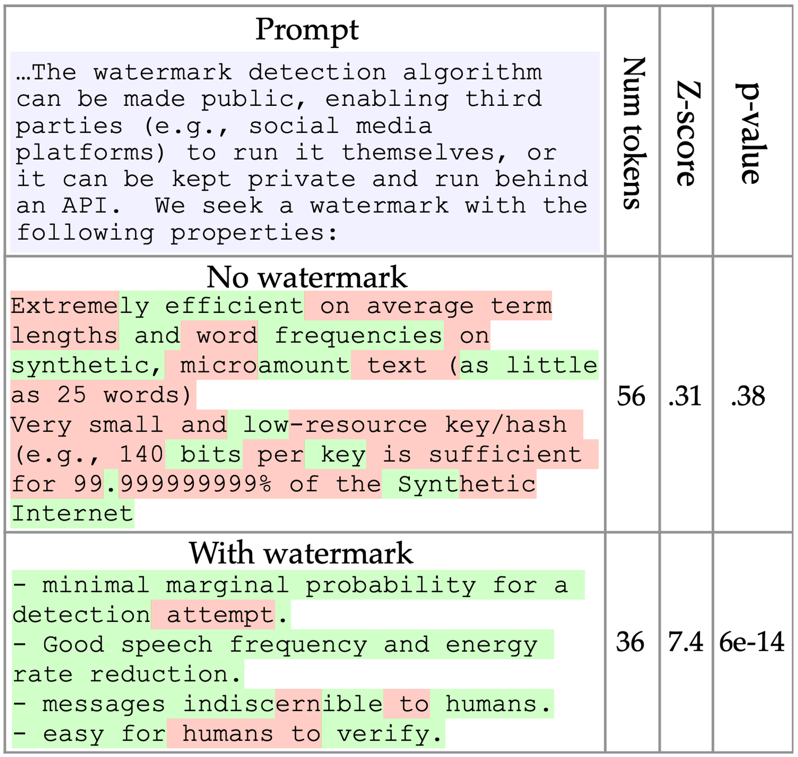
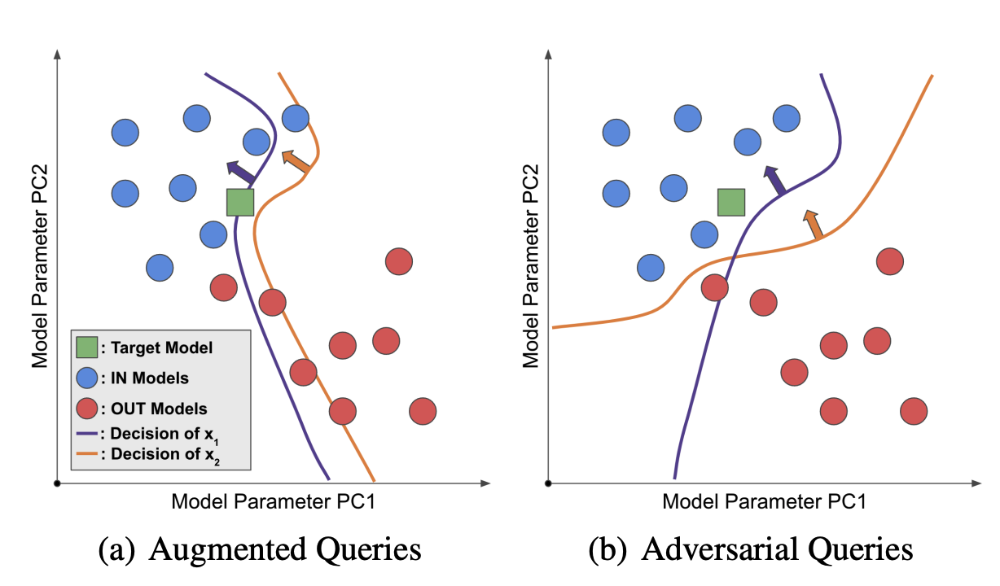
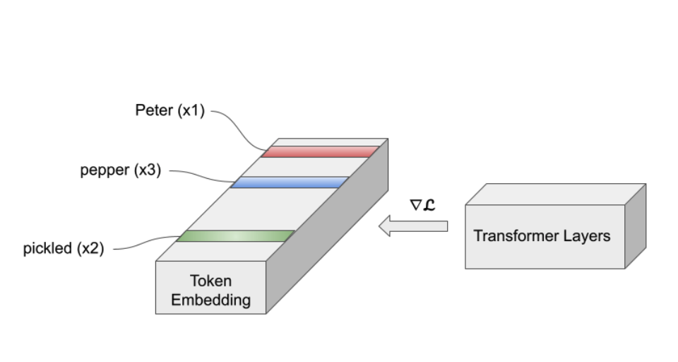
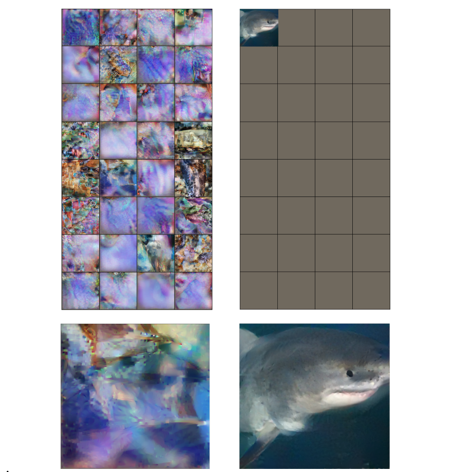

## About Me
I am a second-year Computer Science Ph.D. student at the University of Maryland, College Park, advised by [Prof. Tom Goldstein](https://www.cs.umd.edu/~tomg/). 

I am interested in computer vision and machine learning. My current research mainly focuses on security and privacy in machine learning.

## Selected Publications \[[Full List](https://scholar.google.com/citations?user=oUYfjg0AAAAJ&hl=en)\]

__Tree-Ring Watermarks: Fingerprints for Diffusion Images that are Invisible and Robust__ \\
<u>Yuxin Wen</u>, John Kirchenbauer, Jonas Geiping, Tom Goldstein \\
_Under Review_ \\
\[[paper](https://arxiv.org/abs/2305.20030)\]\[[code](https://github.com/YuxinWenRick/tree-ring-watermark)\]

<!--  -->

__Hard Prompts Made Easy: Gradient-Based Discrete Optimization for Prompt Tuning and Discovery__ \\
<u>Yuxin Wen</u>\*, Neel Jain\*, John Kirchenbauer, Micah Goldblum, Jonas Geiping, Tom Goldstein \\
_Under Review_ \\
\[[paper](https://arxiv.org/abs/2302.03668)\]\[[code](https://github.com/YuxinWenRick/hard-prompts-made-easy)\]\[[demo](https://huggingface.co/spaces/tomg-group-umd/pez-dispenser)\]

<!--  -->

__A Watermark for Large Language Models__ \\
John Kirchenbauer\*, Jonas Geiping\*, <u>Yuxin Wen</u>, Jonathan Katz, Ian Miers, Tom Goldstein \\
_ICML 2023 (Oral)_ \\
\[[paper](https://arxiv.org/abs/2301.10226)\]\[[code](https://github.com/jwkirchenbauer/lm-watermarking)\]\[[demo](https://huggingface.co/spaces/tomg-group-umd/lm-watermarking)\]

<!-- __Styx: Adaptive Poisoning Attacks against Byzantine-Robust Defenses in Federated Learning__ \\
<u>Yuxin Wen</u>\*, Jonas Geiping\*, Micah Goldblum, Tom Goldstein \\
_ICASSP 2023_ -->

<!--  -->

__Canary in a Coalmine: Better Membership Inference with Ensembled Adversarial Queries__ \\
<u>Yuxin Wen</u>, Arpit Bansal, Hamid Kazemi, Eitan Borgnia, Micah Goldblum, Jonas Geiping, Tom Goldstein \\
_ICLR 2023 (notable-top-25%)_ \\
\[[paper](https://arxiv.org/abs/2210.10750)\]\[[code](https://github.com/YuxinWenRick/canary-in-a-coalmine)\]

<!--  -->

<!-- __Decepticons: Corrupted Transformers Breach Privacy in Federated Learning for Language Models__ \\
Liam Fowl\*, Jonas Geiping\*, Steven Reich, <u>Yuxin Wen</u>, Wojtek Czaja, Micah Goldblum, Tom Goldstein \\
_ICLR 2023_ \\
\[[paper](https://arxiv.org/abs/2201.12675)\]\[[code](https://github.com/JonasGeiping/breaching)\] -->

<!-- __Thinking Two Moves Ahead: Anticipating Other Users Improves Backdoor Attacks in Federated Learning__ \\
<u>Yuxin Wen</u>\*, Jonas Geiping*, Liam Fowl, Hossein Souri, Rama Chellappa, Micah Goldblum, Tom Goldstein \\
_AdvML Frontiers Workshop, ICML 2022_ \\
\[[paper](https://arxiv.org/abs/2210.09305)\]\[[code](https://github.com/YuxinWenRick/thinking-two-moves-ahead)\] -->

<!--  -->

__Fishing for User Data in Large-Batch Federated Learning via Gradient Magnification__ \\
<u>Yuxin Wen</u>\*, Jonas Geiping\*, Liam Fowl\*, Micah Goldblum, Tom Goldstein \\
_ICML 2022_ \\
\[[paper](https://arxiv.org/abs/2202.00580)\]\[[code](https://github.com/JonasGeiping/breaching)\]

## Services
Reviewer: ICML, NeurIPS

## Contacts
ywen [ at ] umd [dot] edu

Iribe Center, Office 2116  
8125 Paint Branch Dr,  
College Park, MD 20742

<!--  -->
<!--  -->